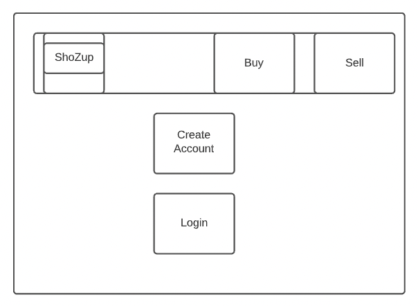
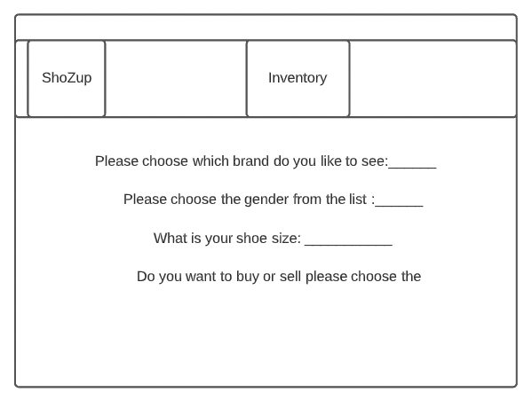

<h1 align="center"> ShoZup👟</h1>

<p align="center">
    
    
    
    
    
    
</p>

## Table of Contents
- [Table of Contents](#table-of-contents)
- [User Story 📖](#user-story-)
- [Acceptance Criteria](#acceptance-criteria)
- [Tools Used 🛠](#tools-used-)
- [Deployment](#deployment)
- [Wireframe](#wireframe)
- [Installation 💾](#installation-)
- [References](#references)
- [Contributing](#contributing)


## User Story 📖

```
ShoZup is an app where all users can buy and/or sell new or used shoes to other users.
```
## Acceptance Criteria

```
- Use Node.js and Express.js to create a RESTful API.

- Use Handlebars.js as the template engine.

- Use MySQL and the Sequelize ORM for the database.

- Have both GET and POST routes for retrieving and adding new data.

- Use at least one new library, package, or technology that we haven’t discussed.

- Have a folder structure that meets the MVC paradigm.

- Include authentication (express-session and cookies).

- Protect API keys and sensitive information with environment variables.

- Be deployed using Heroku (with data).

- Have a polished UI.

- Be responsive.

- Be interactive (i.e., accept and respond to user input).

- Meet good-quality coding standards (file structure, naming conventions, follows best practices for class/id naming conventions, indentation, quality comments, etc.).

- Have a professional README (with unique name, description, technologies used, screenshot, and link to deployed application).
```

## Tools Used 🛠
- [Trello]()
- [Presentation]()
- [Wireframe]()


## Deployment

- [Github](https://github.com/dparmar32/ShoZup)
- [Heroku](https://shozup.herokuapp.com/)

## Wireframe




## Installation 💾   

`npm init`

`npm install`
`npm run seed`

Dependencies: express, express-handlebars, express-session, mysql2, sequelize.

## References
- [Node](https://nodejs.org/api/)
- [NPM Packages](https://www.npmjs.com/)
  
## Contributing
✉️ Contact us with any questions: 
* [Maria Cardona](https://github.com/mechas8703)

* [Drashtee Parmar](https://github.com/dparmar32)

* [Jonathan Sewell](https://github.com/jjsr17)
